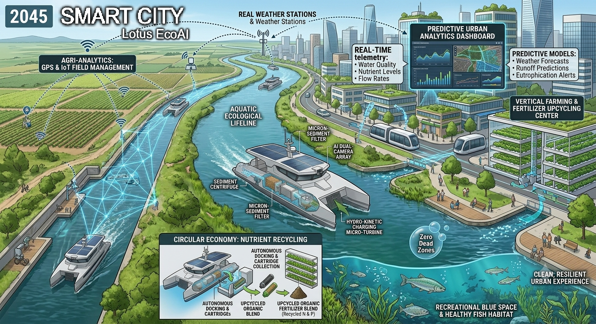
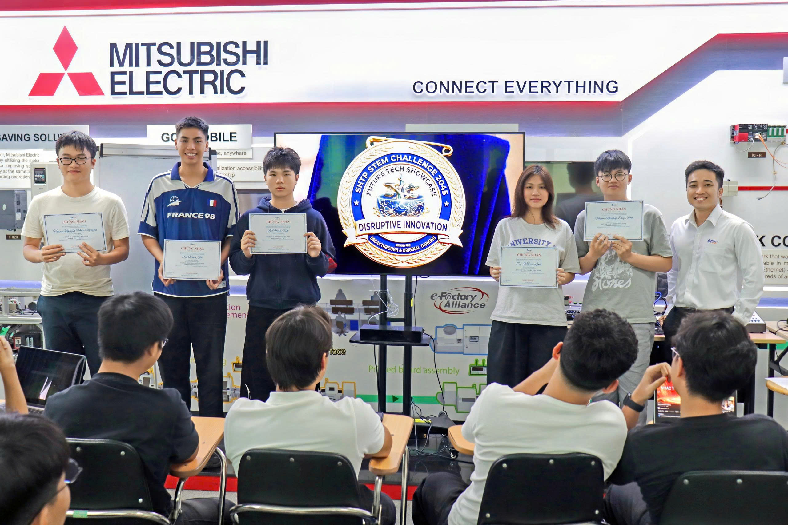

# 🌍 STEM CHALLENGE: PAINTING THE FUTURE OF SMART SOCIETY 2045

Welcome, young founding teams, to your final Capstone Project repository and management workspace! This is where your team will digitize your ideas, architect technological solutions, and build your "investment pitch profile" for the upcoming **Demo Day (Future Tech Showcase)**.

---

## 🛠️ STUDENT GUIDE (READ CAREFULLY BEFORE PROCEEDING)

### 1. How to Initialize Your Team's Project from This Template
* **Step 1:** The Team Representative (Team Leader/CEO) clicks the green **"Use this template"** button in the top right corner ➔ Select **"Create a new repository"**.
* **Step 2:** Name your Repository using the following syntax: `Class_TeamName_ProjectName` (e.g., `STEM02_GreenBrain_WasteSorting`). Set the visibility to **Public**.
* **Step 3:** Go to **Settings** ➔ **Collaborators** ➔ Click **Add people** to invite all team members and your Mentor(s) to co-manage the repository.

### 2. Weekly Submission Roadmap (3-Week Timeline)
* ⏰ **Deadline:** 11:59 PM every Saturday.
* 📦 **Submission Method:** Teams upload image files/documents to the designated directories and update the corresponding content in **[PART II]** below.

| Week | Tasks & Deliverables | Directory to Update on GitHub |
| :--- | :--- | :--- |
| **Week 1 (July 11)** | **Ideation Brainstorming & Systems Thinking Mapping** - Allocate the 5 core roles within the team. - Select 1 major societal challenge (Pollution, Traffic, Healthcare, etc.). - Map out the cause-and-effect system diagram. | 📁 Upload the diagram image to: `/research_system` 📝 Complete the team profile in sections **1** and **2** below. |
| **Week 2 (July 25)** | **Startup Architecture & Technological Solutions** - Define Startup Name, Slogan, and Target Customers. - Propose a solution integrating core technologies (AI, Robotics, IoT, etc.). - Self-evaluate the project idea based on the 50-point matrix. | 📝 Update solution details and technological frameworks in sections **3** and **4** below. |
| **Week 3 (August 1)** | **Smart Society Visual Conception & Final Slide Deck** - Finalize the 2045 Smart Society Visual Conception Drawing. - Synthesize the "Reflection & Knowledge Discovery" section. - Prepare a 15-minute pitch deck for Demo Day. | 📁 Upload the conceptual drawing to: `/design_visuals` 📁 Upload the pitch deck (PDF) to: `/pitch_deck` 📝 Complete all remaining sections below. |

*Note: Once your team is familiar with the workflow, you may delete **PART I** (Student Guide) and keep only **PART II** (Startup Profile) as the main landing page of your project repositor.*

---

# [PART II] STARTUP PROFILE: THE CHRONICLES OF ARCHITECTING SMART SOCIETY 2045

*Students begin documenting their team project from this point forward. Replace placeholder brackets `[...]` with your team's actual information.*

## 🚀 1. STARTUP NAME: [Lotus Eco AI]
* **Slogan:** "[Restoring Waters. Reclaiming Futures.]"
* **Class:** [STEM.02.26]

### 👥 Co-Founding Team (5 Core Roles - 5 Pillars of Synergy)
1. **[Do Le Thuc Linh]** - **CEO (Chief Strategist):**
* **Identity Image / Profile Picture:** [Insert CEO's profile picture or avatar here, or use markdown: ]
* **Responsibilities:** [e.g., Coordinating the team, conducting market research, and making final executive decisions.]
2. **[Le Minh Kiet]** - **Social Researcher:**
* **Identity Image / Profile Picture:** [Insert Social Researcher's profile picture or avatar here, or use markdown: ]
* **Responsibilities:** [e.g., Gathering statistical data, mapping customer pain points, and identifying community needs.]
3. **[Hoang Nguyen Phuc Nguyen]** - **Technology Architect:**
* **Identity Image / Profile Picture:** [Insert Technology Architect's profile picture or avatar here, or use markdown: ]
* **Responsibilities:** [e.g., Designing and executing the technical architecture (AI, Robotics, Drones, IoT, etc.).]
4. **[Pham Nhuong Duy Anh]** - **UX/Experience Designer:**
* **Identity Image / Profile Picture:** [Insert UX Designer's profile picture or avatar here, or use markdown: ]
* **Responsibilities:** [e.g., In charge of conceptual drawings, application user interfaces, and slide deck visualization.]
5. **[Do Hong An]** - **Venture Investor:**
* **Identity Image / Profile Picture:** [Insert Venture Investor's profile picture or avatar here, or use markdown: ]
* **Responsibilities:** [e.g., Evaluating feasibility, conducting cost-benefit analyses, and constructing the business model.]

---
## ⚠️ 2. PROBLEM STATEMENT & SYSTEMS THINKING ANALYSIS
* **Core Problem Statement:** [Agricultural runoff (nutrient over-enrichment and sedimentation from surrounding land use) is systematically degrading wetland ecosystems. This nonpoint source pollution overwhelms the natural filtration capacities of wetlands, leading to severe biodiversity loss, water quality deterioration, and the breakdown of vital ecological services.].
* **Cause-and-Effect Deep Dive:**
  * *Root Causes:* [Intensive Fertilizer Usage / Unsustainable Land Management / Loss of Vegetative Buffer Zones / Policy and Water Governance Gaps.]
  * *Direct Consequences:* [Severe Eutrophication / Widespread Hypoxia / Habitat Destruction via Sedimentation / Toxicity and Bioaccumulation.]

*Detailed Systems Thinking Map (Attach the image file from the /research_system directory):*

---

## 💡 3. STARTUP ARCHITECTURE & BUSINESS MODEL
* **Target Customers:** [Agricultural Enterprise Groups & Farm Cooperatives, Municipalities & Regional Water Management Boards, Industrial & Resource Extraction Operations, Environmental Agencies & Conservation NGOs.].
  
* **Startup's Core Solution:** [Lotus EcoAI provides an autonomous, end-to-end water remediation platform centered around the AquaThrive-ASV (Autonomous Surface Vessel). The catamarans are deployed directly into wetland edges, farm canals, and runoff basins. Using dual computer vision cameras and edge-AI, the vessels autonomously navigate shallow waterways to intercept liquid chemical pollutants, excess agricultural nutrients, micro-sediments, and toxic algal blooms before they destroy delicate aquatic ecosystems. Water is drawn through a multi-stage internal filtration system featuring microbial woodchip denitrification, steel-slag phosphorus complexation, and biochar adsorption, while onboard micro-bubble diffusers actively re-oxygenate hypoxic "dead zones."]

* **Core Technology Stack (Check all applicable technologies):**
  * [/] **AI Vision (Computer Vision):** [Onboard Dual-Camera Array that uses real-time computer vision to detect surface algal blooms, water color shifts (turbidity), floating debris, and obstacles in shallow waters.]
  * [/] **Robotics/UAVs & Actuators:** [Shallow-Draft Propulsion & Actuated Intake. Twin low-noise electric thrusters with omnidirectional vectoring allow navigation in as little as 10 cm of water without disturbing benthic soil. Actuated internal intake valves adjust water intake speed based on boat velocity.]
  * [/] **IoT & Cloud Infrastructure:** [Real-Time Telemetry that sends live water quality metrics (dissolved oxygen, pH, temperature, nitrate levels) via 5G/LTE or satellite mesh networks to a centralized cloud dashboard.]
  * [/] **Green Energy (Sustainability):** [Solar Decking & Hydro-Kinetic Charging. The top surface features flexible solar panel arrays, supplemented by an underwater micro-turbine that trickle-charges the battery bank when anchored in flowing runoff currents.]
  * [/] **Big Data & Predictive Analytics:** [Eutrophication Mapping- Cloud algorithms synthesize data from multiple vessels across a watershed to generate heatmaps of nutrient concentrations, predicting algal bloom risks days in advance.]
---

## 🎨 4. SMART SOCIETY VISUAL CONCEPTION 2045
By 2045, modern metropolitan areas operate on a closed-loop, bio-digital infrastructure powered by self-sustaining, autonomous clean-energy fleets like AquaThrive-ASV that act as automated immune systems for urban water networks. Utilizing integrated AI vision, dynamic flow control, micro-bubble aeration, and an expansive mesh of IoT telemetry sensors, these vessels autonomously intercept agricultural and urban runoff, eliminate toxic dead zones, and stream real-time water quality data into predictive analytics dashboards. Furthermore, by harvesting trapped nitrogen and phosphorus from saturated filter cartridges to upcycle into organic fertilizers, this hyper-connected ecosystem eliminates waste, preserves vital municipal water security, and restores healthy biodiversity directly within modern cities.

*Team's Conceptual Drawing (Attach the image file from the /design_visuals directory):*

---

## 🧠 5. REFLECTION & KNOWLEDGE DISCOVERY
Following a 3-week journey of intensive co-creation, our founding team has distilled the following key insights:
* **We discovered that:** [Agricultural runoff is a broken supply chain, not just a pollution problem.].
* **We learned that:** [Tech succeeds only when ecological health aligns with economic self-interest.].
* **Our most unique innovation/competitive edge is:** [Active chemical remediation paired with a circular "Filter-as-a-Service" model.].

---

## 📊 6. PROJECT IDEA SELF-EVALUATION MATRIX (Max: 50 Points)
*The founding team reviews, deliberates, and grades the project according to official Demo Day criteria:*

| Criteria | Maximum Points | Team Self-Score | Rationale & Justification |
| :--- | :---: | :---: | :--- |
| **1. High-Impact Problem Solving** | 10 | `[...]/10` | [Justification...] |
| **2. Innovation & Creativity** | 10 | `[...]/10` | [Justification...] |
| **3. Feasibility & Scalability** | 10 | `[...]/10` | [Justification...] |
| **4. Social & Community Impact** | 10 | `[...]/10` | [Justification...] |
| **5. Business Viability & Marketability** | 10 | `[...]/10` | [Justification...] |
| **TOTAL SCORE** | **50** | `[...]/50` | |

---
🌐 *Project profile meticulously curated by **[Team Name]** in preparation for the **Future Tech Showcase - Demo Day**.*

## 🏆 7. OFFICIAL EVALUATION RESULTS FROM THE JUDGING PANEL (DEMO DAY OFFICIAL SCORE)
---
| Evaluation Criteria from the Panel | Max Score | Judges' Score | In-depth Feedback from the Judging Panel |
| :--- | :---: | :---: | :--- |
| **1. Major Problem Solving & Systems Thinking** | 20 | **17** / 20 | Systematic analysis of agricultural activities; clear system diagram included in the profile. |
| **2. Innovation & Breakthrough Solution** | 20 | **19** / 20 | Highly creative "Mobile Immune System" idea for water sources combined with Filter-as-a-Service and fertilizer recycling. |
| **3. Tech Stack Depth & Technical Feasibility** | 20 | **17** / 20 | Deep environmental science & technology knowledge (Biochar, micro-bubble aeration, IoT). |
| **4. Social Impact & Human-Centered Value** | 15 | **14** / 15 | Feasible circular business model with high practical value for urban and agricultural areas. |
| **5. Collaboration & Teamwork Ability** | 15 | **13** / 15 | Member roles are clearly defined; however, some members need to participate more actively. |
| **6. Presentation Skills & Defense (Q&A)** | 10 | **9** / 10 | Professional English presentation, smoothly answered technical Q&A questions from Judges. |
| **🥇 OFFICIAL TOTAL SCORE** | **100** | **89 / 100** | **FINAL RANKING: GOOD** (Excellent in Innovation) |

--- 
## 🎖️ 8. HONORARY TITLES & TECHNOLOGY BADGES

Based on the project's outstanding strengths, the Judging Panel and SHTP Training proudly award the following prestigious Technology Badge to the young founding team.

### 🌟 **CONGRATULATIONS TO THE STARTUP FOR WINNING THE HONOR:**

## 🏅 **[DISRUPTIVE INNOVATION BADGE]** 🏅

> *"Honoring groundbreaking models and technology, transforming the AquaThrive autonomous fleet into a 'Mobile Immune System' to restore urban water bodies alongside a circular Filter-as-a-Service model."*

💬 *"From sand to AI. From ideas to innovation. From students today… to engineers of tomorrow!"*  
Closing the journey of STEM Challenge 2045 with immense pride at SHTP Training Center.
